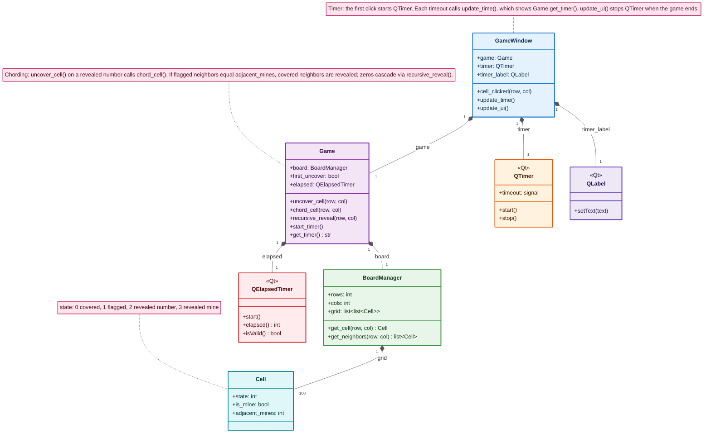

# Minesweeper Timer, Cell, and Chording Diagram

This class diagram shows the timer flow, board composition, cell state, and chording behavior.

```mermaid
%%{init: {"theme": "base", "themeVariables": {"primaryColor": "#FFFFFF", "primaryBorderColor": "#555555", "lineColor": "#555555", "edgeLabelBackground": "#FFFFFF", "noteBkgColor": "#FCE4EC", "noteBorderColor": "#C2185B", "noteTextColor": "#4A0E25"}}}%%
classDiagram
    direction TB

    class GameWindow {
        +game: Game
        +timer: QTimer
        +timer_label: QLabel
        +cell_clicked(row, col)
        +update_time()
        +update_ui()
    }

    class Game {
        +board: BoardManager
        +first_uncover: bool
        +elapsed: QElapsedTimer
        +uncover_cell(row, col)
        +chord_cell(row, col)
        +recursive_reveal(row, col)
        +start_timer()
        +get_timer() str
    }

    class BoardManager {
        +rows: int
        +cols: int
        +grid: list~list~Cell~~
        +get_cell(row, col) Cell
        +get_neighbors(row, col) list~Cell~
    }

    class Cell {
        +state: int
        +is_mine: bool
        +adjacent_mines: int
    }

    class QTimer {
        <<Qt>>
        +timeout: signal
        +start()
        +stop()
    }

    class QElapsedTimer {
        <<Qt>>
        +start()
        +elapsed() int
        +isValid() bool
    }

    class QLabel {
        <<Qt>>
        +setText(text)
    }

    GameWindow "1" *-- "1" Game : game
    GameWindow "1" *-- "1" QTimer : timer
    GameWindow "1" *-- "1" QLabel : timer_label
    Game "1" *-- "1" QElapsedTimer : elapsed
    Game "1" *-- "1" BoardManager : board
    BoardManager "1" *-- "100" Cell : grid

    style GameWindow fill:#E3F2FD,stroke:#1976D2,stroke-width:2px,color:#0D2A4A
    style Game fill:#F3E5F5,stroke:#7B1FA2,stroke-width:2px,color:#3A0E4A
    style BoardManager fill:#E8F5E9,stroke:#388E3C,stroke-width:2px,color:#123A16
    style Cell fill:#E0F7FA,stroke:#00838F,stroke-width:2px,color:#00363A
    style QTimer fill:#FFF3E0,stroke:#E65100,stroke-width:2px,color:#4A1E00
    style QElapsedTimer fill:#FFEBEE,stroke:#D32F2F,stroke-width:2px,color:#4A0B0B
    style QLabel fill:#EDE7F6,stroke:#5E35B1,stroke-width:2px,color:#20124A

    note for GameWindow "Timer: the first click starts QTimer. Each timeout calls update_time(), which shows Game.get_timer(). update_ui() stops QTimer when the game ends."
    note for Game "Chording: uncover_cell() on a revealed number calls chord_cell(). If flagged neighbors equal adjacent_mines, covered neighbors are revealed; zeros cascade via recursive_reveal()."
    note for Cell "state: 0 covered, 1 flagged, 2 revealed number, 3 revealed mine"
```
